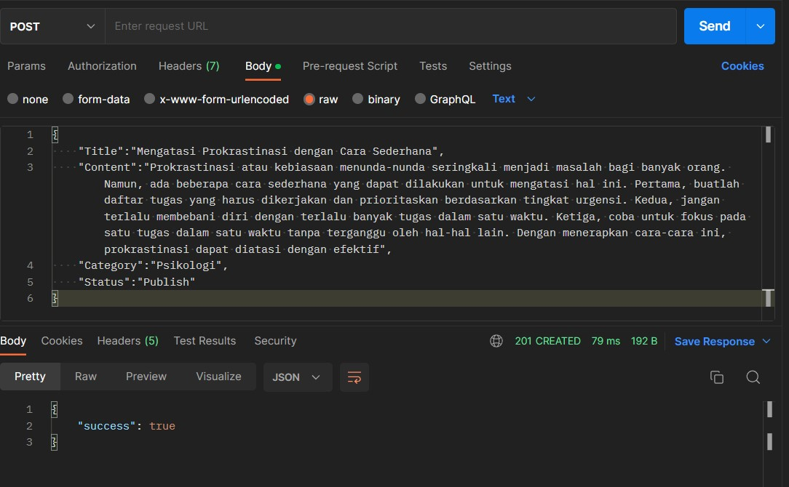
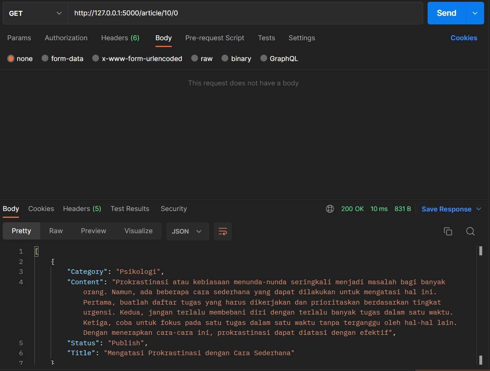
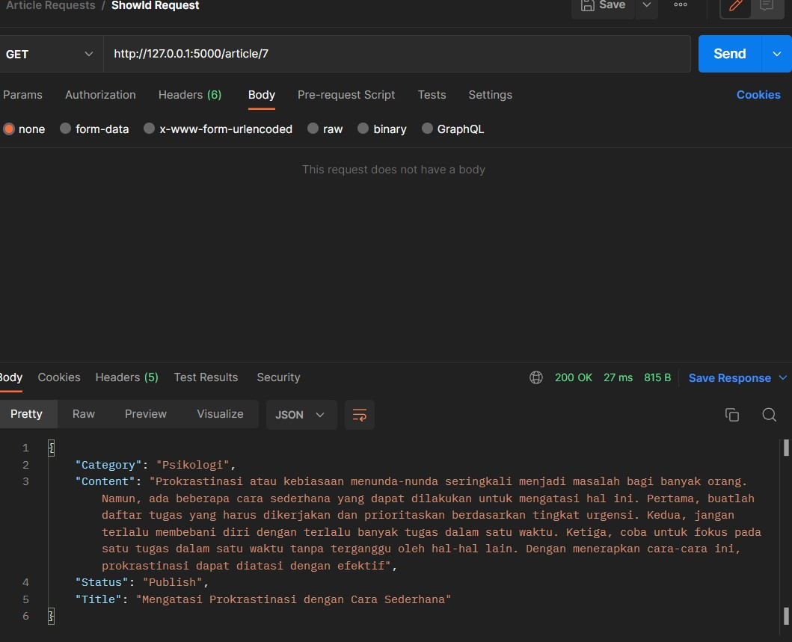
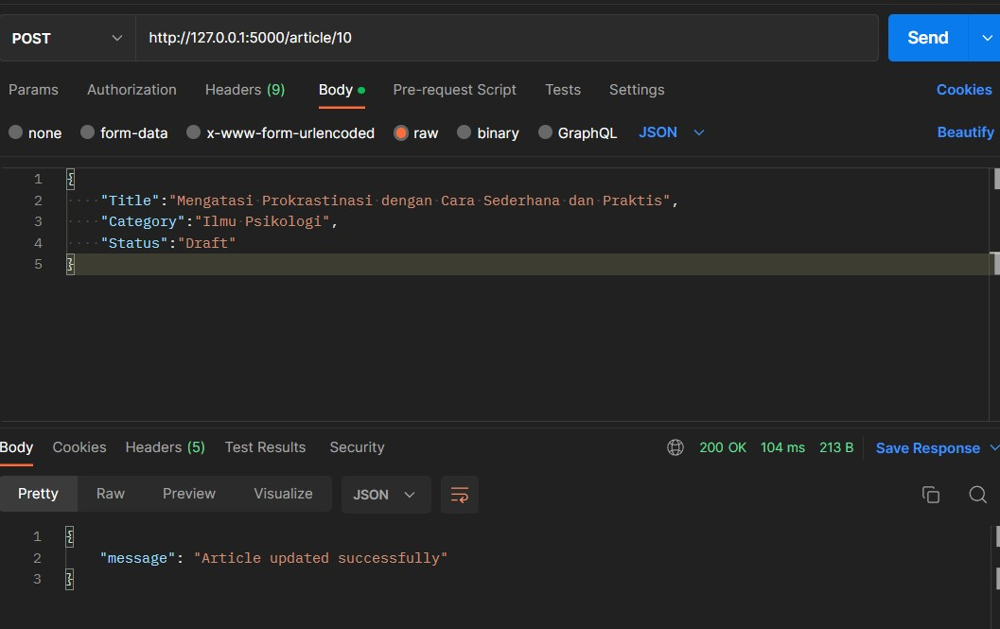
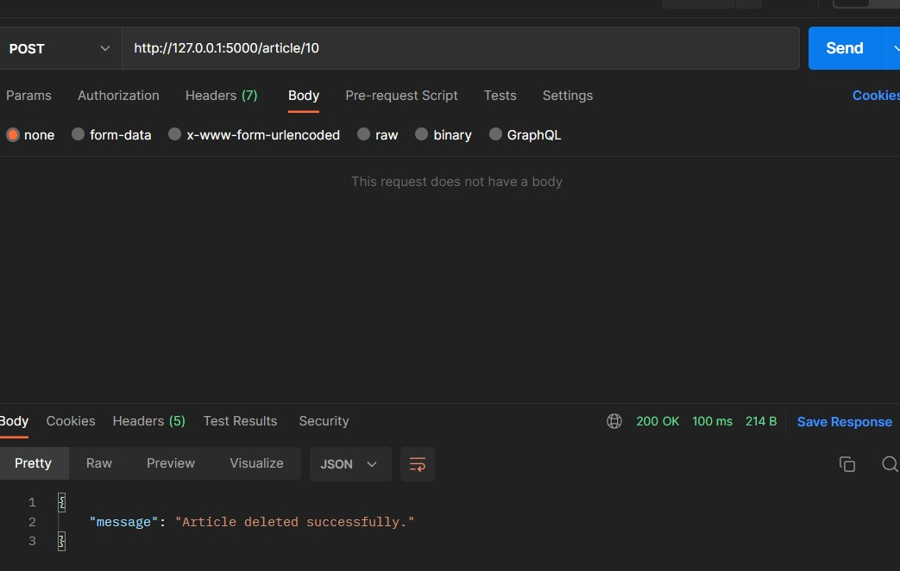
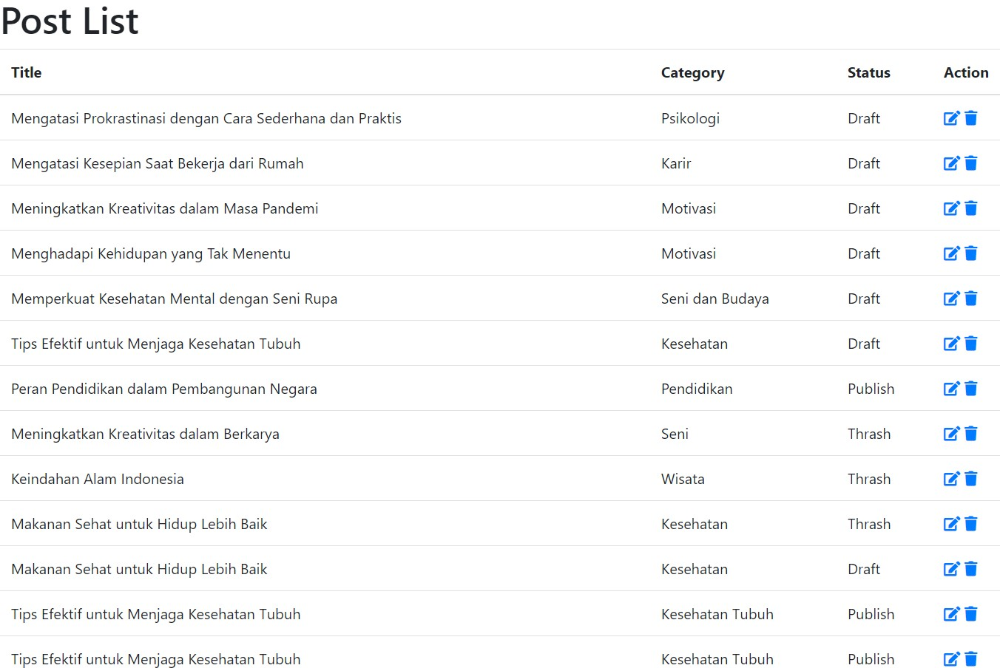
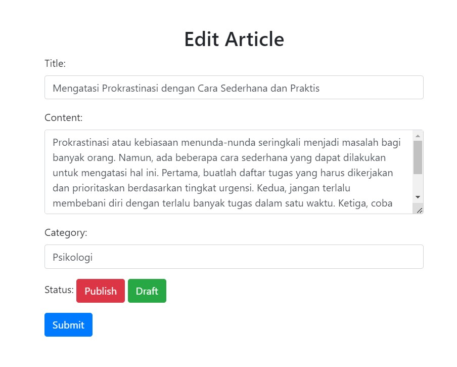
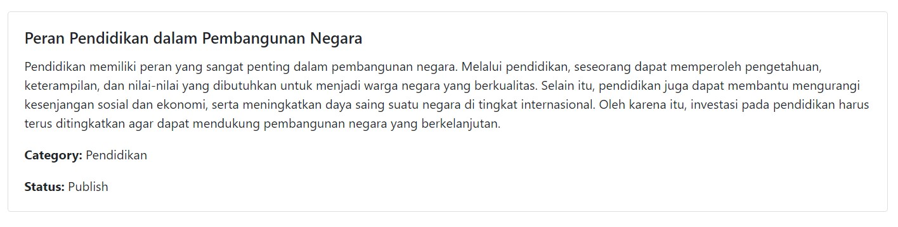

# Test Back-end dan Front-end Sharing Vision

Test Back-end dan juga Front-end Sharing Vision untuk posisi Full-stack Developer

## Back-end Test

### Migration

1. Membuat database Articles dengan table Posts dengan menggunakan createCdb.sql
2. Membuat migrasi melalui python dengan menggunakan migrate.py

### Microservice

3. Membuat berbagai endpoint yang dapat dilihat pada app.py yang dimana menggunakan model Posts 
sebagai referensi ke table
4. Validasi "required" dan minimal total karakter dapat dilihat pada app.py fungsi validate_post_data
dengan parameter 'title','content','category',dan 'status'
5. Membuat Postman Collection dari applikasi postman yang menjalan request terhadap tiap endpoint yang ditambah.
Hasil dari collection dapat dilihat pada Article Requests.postman_collection.json

## Front-end Test

### Halaman index all posts

1. Menampilkan setiap posts yang ada pada table "posts" dalam bentuk tabel yang dimana terdapat tombol edit dan juga
hapus yang terhubung ke endpoint edit dan hapus. File dapat dilihat pada index.html dan juga editarticle.html

### Halaman add new dan preview

2. Menampilkan form untuk membuat article dengan atribut 'title','content','category',dan 'status' dan mengirimkan
request ke endpoint yang telah dibuat pada test back-end sebelumnya dengan metode POST
3. Menampilkan data article sesuai dengan id yang ada pada url. Halaman akan menampilkan data berupa 
'title','content','category',dan 'status'

